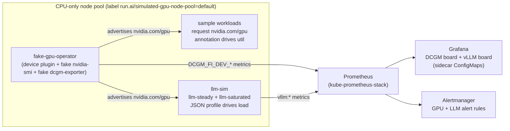
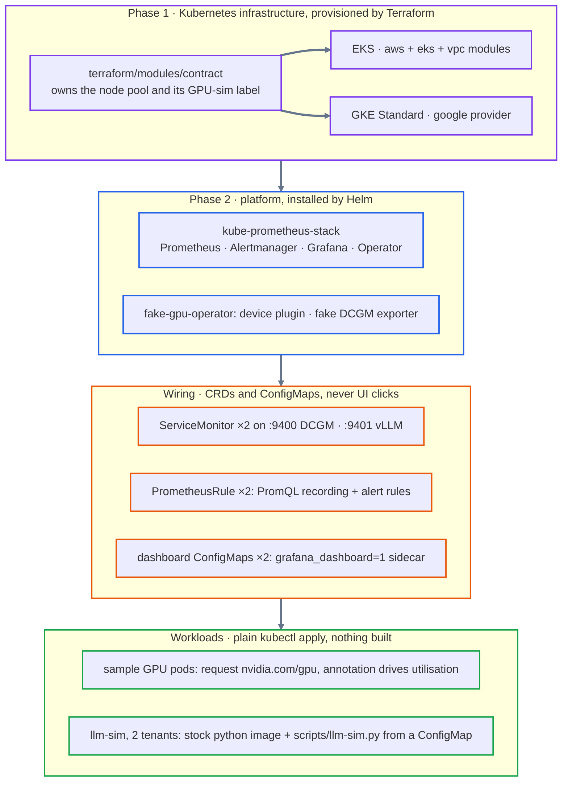

# Architecture

## Runtime overview

The two simulations are **independent**: nothing makes GPU utilisation follow LLM load.
See [llm-simulation.md](llm-simulation.md#gpu-and-llm-load-are-independent).

## Technology stack

[Runtime overview](#runtime-overview) shows what runs; this is what it is built from, grouped by layer
and read top to bottom.

The one ordering fact worth carrying: the wiring is applied *before* the workloads it selects.
That is fine, because ServiceMonitors and rules are declarative selectors and match whatever
appears afterwards. `install.sh` interleaves the two Helm charts around that step rather than
installing both up front — [Install ordering](#install-ordering-why-installsh-is-staged-the-way-it-is) below has the exact sequence
and the reason for each stage.

Versions are deliberately absent below, so this diagram never disagrees with
[Pinned versions](versions.md). The Task and Make front doors are
also left out, being thin wrappers over `scripts/`; see [Install](../README.md#install).

The `kube-prometheus-stack` box is a bundle. Alongside Prometheus, Alertmanager and Grafana it
brings the Prometheus Operator — which is what turns the ServiceMonitor and PrometheusRule CRDs
in the next layer into actual scrape and rule configuration — plus kube-state-metrics and
node-exporter.

What the stack deliberately *omits* is as load-bearing as what it contains:

| What's absent | Why |
|--|--|
| `pip install` / Python deps | a hard constraint: `python3 scripts/llm-sim.py --selftest` runs anywhere, no venv |
| GPU hardware, drivers, quota or model weights | the whole point; CPU-only nodes on both clouds |
| dashboards clicked into Grafana | boards are ConfigMaps, so a re-install reproduces them exactly |
| grafana.com egress at install time | both dashboards ship in-repo; the cluster needs no reachability to render them |
| managed/cloud Prometheus | one self-hosted stack keeps EKS and GKE byte-identical above the node pool |

**A container image build for the simulator was in that table and has been removed from
it.** Its reasoning — stdlib-only Python mounted into a stock image, so there is nothing
to build, push or keep patched — described how the *rig* runs the simulator, and remains
true of that path: `install.sh` builds the `llm-sim-script` ConfigMap from
`scripts/llm-sim.py`, the compose stack mounts the same file, and neither needs a build
step. The omission is no longer claimed because it says nothing about how the simulator
reaches anyone who has not cloned this repo, which is the case a published image exists to
serve.

**That image has since shipped**: `Dockerfile` builds it and `publish-image.yml` pushes
`ghcr.io/<owner>/vllm-metrics-sim` on every release tag, for `linux/amd64` and
`linux/arm64`. It is *derived* from `scripts/llm-sim.py` in the same way `dist/` and the
dashboard ConfigMaps are, never committed beside it — CI asserts no second copy exists in
the tree, and that what the image serves is that file byte for byte. A drifted copy of the
simulator would be undetectable from outside, which is exactly what
[`tests/contracts/`](../tests/contracts/) exists to prevent for the DCGM surface. See
[below](#two-artefacts-that-are-not-part-of-a-cluster-install).

## Components

| Component | Namespace | Role |
|-----------|-----------|------|
| fake-gpu-operator | `gpu-operator` | Device-plugin DaemonSet advertises `nvidia.com/gpu` **and** injects the fake `nvidia-smi`/topology via its `Allocate()` response (no webhook — see below); fake `dcgm-exporter` DaemonSet emits **three** `DCGM_FI_DEV_*` metrics (`GPU_UTIL`, `FB_USED`, `FB_FREE`) — see [observability.md](observability.md#metrics). |
| kube-prometheus-stack | `monitoring` | Prometheus (scrape + rules), Grafana (dashboards), Alertmanager, node-exporter, kube-state-metrics, the Prometheus Operator + its admission webhook. |
| ServiceMonitor `fake-dcgm-exporter` | `monitoring` | Tells Prometheus to scrape the fake dcgm-exporter in `gpu-operator`. |
| PrometheusRule `gpu-simulation-alerts` | `monitoring` | Two groups: `gpu.simulation.derived` (recording rules that synthesise `DCGM_FI_DEV_GPU_TEMP` / `_POWER_USAGE` from utilisation, since the exporter emits neither) and `gpu.simulation.rules` (utilisation / memory / metrics-absent alerts). |
| Sample workloads | `default` | Deployments requesting `nvidia.com/gpu`; pod-template annotation drives simulated utilisation. |
| LLM simulators | `llm-sim` | `llm-steady` (healthy) and `llm-saturated` (overloaded on purpose) run `scripts/llm-sim.py`, emitting the real **vLLM** metric surface. A polled JSON profile drives load without restarting the pod. Opt-in `llm-driven` is the target for `drive-llm-load.sh`. |
| ServiceMonitor `llm-sim` | `monitoring` | Scrapes the simulators every 15s. |
| PrometheusRule `llm-simulation-alerts` | `monitoring` | `llm:*` recording rules aggregated `by (model_name)` — the TTFT/TPOT percentiles, the prefix-cache ratio, the token rates, and the four **means** the request phase breakdown is built from — plus `LLMHighTTFT`, `LLMQueueBacklog`, `LLMKVCacheSaturated`, `LLMMetricsAbsent`. |

### Two artefacts that are not part of a cluster install

Both are *derived* from files already in the tree, on the same terms as `dist/` and the
dashboard ConfigMaps: one source, several forms. Neither is a second copy, and CI fails if
one appears.

| Artefact | Built by | What it is for |
|--|--|--|
| `ghcr.io/<owner>/vllm-metrics-sim` | `Dockerfile`, pushed by `publish-image.yml` on a release tag | Pointing **someone else's** dashboards at a realistic vLLM metric surface without cloning this repo. ⚠️ *Not* how this rig runs the simulator — see [llm-simulation.md](llm-simulation.md#-what-this-image-is-not). |
| `charts/k8s-ai-observability` | `task chart`, assembled into gitignored `dist/` | Installing the rules, boards, simulators and workloads onto a cluster that **already runs Prometheus**, without `install.sh` touching its monitoring stack. |

⚠️ **The chart is the one place the simulator runs from the image rather than the
ConfigMap**, and that is a consequence of Helm rather than a preference: `.Files.Get`
cannot read outside the chart directory, so the chart cannot reach `scripts/llm-sim.py`
where it lives, and a second committed copy is refused. Referencing a published image needs
a *tag* instead of the file, which is what makes the constraint tractable at all — see the
chart's [README](../charts/k8s-ai-observability/README.md).

## Data flow

1. Terraform labels the CPU node pool `run.ai/simulated-gpu-node-pool=default`.
2. fake-gpu-operator sees the label, and its device plugin advertises `nvidia.com/gpu`
   (count from `topology.nodePools.default.gpuCount`).
3. Sample pods request `nvidia.com/gpu`; the scheduler places them on the labelled
   nodes; kubelet calls the device plugin's `Allocate()`, whose response bind-mounts the
   fake `nvidia-smi` and sets `MOCK_NVIDIA_VISIBLE_DEVICES` in the container.
4. The fake `dcgm-exporter` publishes `DCGM_FI_DEV_*` metrics reflecting each pod's
   `run.ai/simulated-gpu-utilization` annotation.
5. Prometheus scrapes those metrics (via the ServiceMonitor), evaluates the recording
   rules (which derive temperature/power from utilisation) and the alert rules, and
   Grafana renders the DCGM dashboard (shipped as a sidecar ConfigMap). The dashboard's
   temp/power panels therefore depend on the PrometheusRule, not just the exporter.

### LLM serving (a second, parallel flow)

1. Each simulator pod reads a JSON **load profile** from a mounted ConfigMap and models
   request arrival → queue → prefill → decode → completion in wall-clock time.
2. It serves `vllm:*` metrics on `:9401`. Serving a scrape is a pure read — it never
   advances a counter, so probes and manual `curl`s cannot perturb the data.
3. Prometheus scrapes it every 15s; recording rules compute latency percentiles
   `by (model_name)`; Grafana renders the second dashboard.
4. `llm-steady` also requests one `nvidia.com/gpu`, purely so the device plugin injects
   `MOCK_NVIDIA_VISIBLE_DEVICES`, which it republishes as `llmsim_gpu_binding_info`.
   That label is `device_id`, **not** `UUID`: chart 0.0.59 injects the plugin's own
   per-allocation id, which never equals the `GPU-`-prefixed UUID the exporter uses, so
   the pod↔DCGM join goes through `(namespace, pod)` instead. See `detect_binding()` in
   `scripts/llm-sim.py` for the working expression.

**The two flows are independent.** Nothing makes GPU utilisation follow LLM load: GPU load
comes from pod annotations, LLM load from the polled profiles, and coupling them would need
a pod restart that resets the LLM counters. The cross-domain dashboard panel demonstrates
the *query pattern*, not causation — see
[llm-simulation.md](llm-simulation.md#gpu-and-llm-load-are-independent).

## Ordering & readiness (why install.sh is staged)

- kube-prometheus-stack is installed **first** with `--wait`, so the `ServiceMonitor` /
  `PrometheusRule` **CRDs and the validating webhook** exist before we apply our
  ServiceMonitor and alert rules (else the apply is rejected).
- fake-gpu-operator is installed with `--wait`, then we wait for its **DaemonSets** to
  roll out **before** creating sample workloads, so the device plugin is advertising
  `nvidia.com/gpu` by the time they schedule.
- Teardown reverses this and **drains any cloud LB/PVC before `terraform destroy`** so
  nothing dangles. An unreachable cluster skips that stage rather than aborting, so
  `--destroy` can still remove infrastructure after the cluster is already gone.

### There is no mutating webhook

It is widely assumed — and earlier revisions of this document claimed — that the fake
`nvidia-smi` is injected by a **mutating admission webhook**. It isn't, and there is no
`MutatingWebhookConfiguration` for it on a running cluster. Injection happens in the
**device plugin's `Allocate()` response** — the same mechanism the real NVIDIA plugin
uses — which kubelet applies at container-create time. Two consequences worth knowing
before you debug anything here:

- The injected bits are **invisible in the pod spec**. `kubectl get pod -o json` shows no
  extra env or mounts; you have to look inside the running container.
- Inside the container, `/bin/nvidia-smi` is a bind-mount from the host and the only env
  var is **`MOCK_NVIDIA_VISIBLE_DEVICES`** (not `NVIDIA_VISIBLE_DEVICES`). **Running it
  panics** — it is not a working fidelity check. Verify GPUs via node allocatable and the
  DCGM series instead (`scripts/verify.sh`).

### Expected-looking failures that are not failures

In the `gpu-operator` namespace, `deployment/gpu-operator` and
`deployment/nvidia-dcgm-exporter` sit permanently at **0/0 by design** — the first is a
placeholder so tools probing for "a gpu-operator deployment" find one, the second is a
template the operator clones onto KWOK virtual nodes. The exporter that actually serves
metrics is the **DaemonSet** of the same name. `daemonset/mig-faker` at 0 is likewise
expected (its selector matches no node on this rig). Every workload the chart installs
also references an `imagePullSecrets: gcr-secret` that does not exist, producing recurring
`FailedToRetrieveImagePullSecret` warnings; pulls succeed anonymously because the images
are public. Judge this stack functionally, via `scripts/verify.sh`, not by replica counts.

## EKS ↔ GKE differences (kept minimal by design)

| Concern | EKS | GKE |
|---------|-----|-----|
| Provisioning | `terraform-aws-modules/eks` + VPC module, managed node group | `google_container_cluster` (**Standard**) + node pool |
| Cluster mode caveat | — | **Must be Standard, not Autopilot** (Autopilot blocks the device-plugin hostPath) |
| Node image / arch | EKS-optimised AL2023 (amd64), stock | `COS_CONTAINERD` (amd64), stock |
| Node bootstrap | None — the image is already node-ready | None — the image is already node-ready |
| Auth for Phase 2 | `aws eks update-kubeconfig --alias gpu-sim-eks` | `gcloud ... get-credentials` + `gke-gcloud-auth-plugin`, context renamed to `gpu-sim-gke` |
| Node count knob | total desired size | **per-zone** (regional cluster ≈ ×3) |
| Storage | ephemeral (avoids EBS-CSI + IRSA) | ephemeral (default PD not needed) |

Everything else — namespaces, Helm releases, ServiceMonitors, alert rules, dashboards,
sample workloads, the LLM simulation, the naming invariants — is **identical** across both
clouds. The LLM stack adds **no** EKS↔GKE difference at all: it is a stock public image, a
ConfigMap and a Deployment.

## Install ordering (why `install.sh` is staged the way it is)

| Step | What | Why here |
|------|------|----------|
| 1 | Helm repos | — |
| 2 | kube-prometheus-stack (`--wait`) | Its CRDs **and** validating webhook must exist before any ServiceMonitor or PrometheusRule is applied |
| 2b | Dashboards, ServiceMonitors, alert rules | CRDs now present; whole directories, so GPU and LLM manifests land together |
| 3 | fake-gpu-operator (`--wait` + DaemonSet rollout) | Nodes must be advertising `nvidia.com/gpu` before anything requests one |
| 4 | Sample GPU workloads | Need step 3 |
| 5 | LLM simulators | After 3 so `llm-steady`'s optional GPU request is satisfiable; it runs unbound if none is free |

Teardown reverses it, and the LLM namespace deletion cascades to everything inside it.

## The naming invariant (read before editing)

Three things must all read `default` — the node label *value*, the fake-operator *topology pool
name*, and the Helm *selector*. It is defined once in `terraform/modules/contract` and
`scripts/config.sh`; keep those aligned.

> **⚠️ A mismatch gives you a green install with zero GPUs** — no error, no failed pod, just an
> empty board.

Which artefact applies that label depends on the target, so each has its own cross-check
in `scripts/config.sh`, and `install.sh` runs the right one:

| Target | Applies the label | Cross-checked by |
|--|--|--|
| `eks` / `gke` | `terraform/modules/contract` | `assert_terraform_contract` (against real Terraform outputs) |
| `local` | `kind/gpu-sim.yaml` | `assert_kind_contract` (cluster name, node label, node-image minor) |

On local the label is set at cluster-creation time rather than applied afterwards, so it cannot
be skipped. `scripts/kind-up.sh` additionally asserts that a node really carries it before
declaring the cluster ready, because kind accepts a `labels` block it then fails to apply
without complaining.
