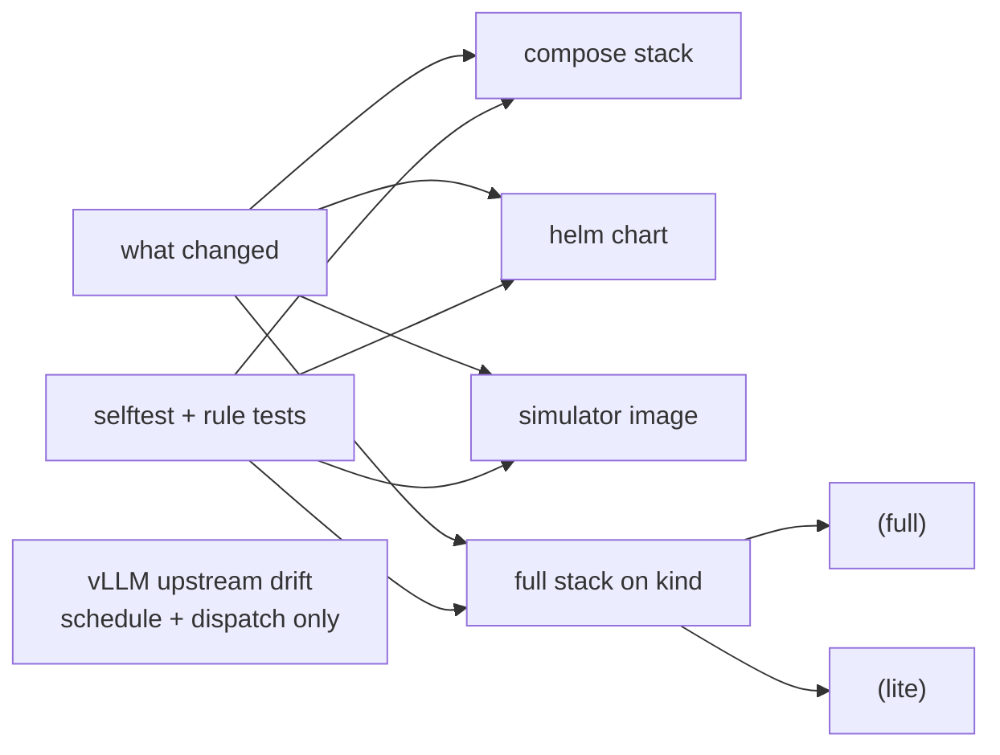

# The CI pipeline

Most Kubernetes infrastructure repos cannot test themselves. They need hardware, or a
cloud account, or quota someone has to approve, so CI ends up linting YAML and dry-running
Helm and hoping. This repo's whole premise is *no GPU hardware, quota, drivers or model
weights required*, and that has a happy consequence: **it can prove its own claim on a free
runner.**

So CI does not check that the manifests parse. It stands up a real Kubernetes cluster,
installs everything, and runs every acceptance check in `scripts/verify.sh` against it. If
the README says `task local:up` works, a machine that has never seen a GPU proves it on
every pull request.

Everything below lives in [`.github/workflows/ci.yml`](../.github/workflows/ci.yml). That
file is heavily commented and is the authority; this page is the map, and points at it
rather than repeating it.

---

## The shape of a run



Two jobs open every run and gate everything else:

**`what changed`** works out whether anything a cluster could possibly test has moved. If a
pull request touches nothing but `.md` files, there is no point standing up two clusters and
a compose stack, so the expensive jobs are skipped.

**`selftest + rule tests + shell syntax`** is the cheap one. It takes seconds, needs no
cluster and no network, and it runs on *every* run without exception. The reasoning is worth
knowing: a wall of green skips on a docs-only pull request tells you nothing, so at least one
check should always have genuinely executed.

Everything else hangs off those two.

---

## The jobs, one at a time

| Job | What it proves | Timeout |
|--|--|--|
| `what changed` | whether this diff can affect anything a cluster tests | 5 min |
| `selftest + rule tests + shell syntax` | the simulator's own exposition, the alert and recording rules, prose vs code, shell and Python syntax | 5 min |
| `compose stack (no Kubernetes)` | the Docker Compose path works, boards load, targets are up | 10 min |
| `helm chart (lint, render, assertions fire)` | the chart renders both ways, and every render-time assertion still *fires* | 15 min |
| `simulator image (build both arches, smoke-test amd64)` | the image builds for amd64 and arm64 and actually serves metrics | 15 min |
| `chart on kind (helm test, foreign Prometheus)` | the chart installs, and `helm test` both fails and passes for the right reasons | 30 min |
| `full stack on kind (full)` / `(lite)` | the real thing, end to end, twice | 90 min |
| `vLLM upstream drift (buckets + metric set)` | upstream vLLM has not moved under us | 5 min, weekly |
| `branch ruleset vs required-checks.txt` | the branch protection settings still match what the repo records | 5 min, weekly |

### selftest + rule tests + shell syntax

The fast gate, and the one that catches most mistakes. It runs the simulator's selftest
(histogram bucket monotonicity, `+Inf` consistency, `HELP`/`TYPE` correctness), the compose
GPU producer against the DCGM surface contract, `promtool` tests for the alert and recording
rules, and `scripts/check-doc-claims.py`, which compares prose in the markdown against the
code it describes.

It also runs `check-sigpipe.py`, which finds pipes whose consumer stops reading
before the producer finishes. Under `pipefail` that turns a correct result into exit
141, and it has bitten twice: it failed a chart publish on an archive that contained
everything it was asked to prove, and in this very workflow's changes filter it would
have reported a large code change as "markdown only" and skipped the cluster jobs.
⚠️ Neither reproduces under `zsh`, so a laptop will not find them — test that class
with `bash -c`.

The doc-claims check exists because documentation drift here is a *known failure class*. Dashboard
ids, "emits N metrics" claims and version numbers have all been wrong in prose while being
right in code. The checker derives every expected value at run time and holds no copy of any
truth, so it cannot drift itself.

`task preflight` runs the same gates locally. Running it before you push is the single
highest-value habit in this repo.

### compose stack

Not everyone wants a Kubernetes cluster to look at a dashboard. The compose path mounts the
same simulator, the same dashboards and the same rules, and this job proves it: brings the
stack up, waits for Prometheus and Grafana, asserts both producers are visible *through
Prometheus*, checks every scrape target is up, and fetches both boards anonymously by `uid`.

It uploads its logs if anything fails, and tears the stack down either way.

### helm chart

Lints the chart, then renders it **both ways round**: with `kubePrometheusStack.enabled`
false (the BYO case the chart exists for) and true (greenfield, where the subchart's own
templates render too, which is a genuinely different code path).

The interesting half is the next step. The chart carries render-time assertions, and this
job drives every one of them to its *failure*, deliberately feeding in broken values to
confirm each still refuses. An assertion that has quietly stopped firing looks exactly like
one that passes, which is the regression this catches.

### simulator image

Builds `linux/amd64` and `linux/arm64`, loads the amd64 build into the runner, runs it, and
scrapes `/metrics`. It also asserts that the port override is `LLM_SIM_LISTEN_PORT` and that
`LLM_SIM_PORT` is ignored, because that was a real trap.

Only amd64 is executed: the runner is amd64. Both architectures are built.

### chart on kind

⚠️ **Until this job existed, nothing on a pull request ever installed the chart.** The
`helm chart` job lints and renders and never touches a cluster; the `full stack on kind`
job installs through `install.sh`, the *script* path. So the chart's own `helm test` — the
only thing that checks the two silent-failure labels against a live cluster — ran solely in
the publish workflow, on a tag.

That is how chart `0.2.0` reached the registry with `helm test --logs` exiting 1 on a chart
where every hook had succeeded: a green result reported as red, on the exact command the
chart README tells people to run. Registry versions are immutable, so it is still there.

This job creates its own cluster, installs kube-prometheus-stack under a release name this
repo would never choose, and then asserts **both** directions: `helm test` must **fail**
with the default `releaseLabel`, and pass once it is set. An assertion that only ever
passes is not an assertion.

It needs its own cluster rather than a step on `full stack on kind`, because the chart's
default namespaces are the same ones `install.sh` uses and Helm will not adopt resources it
does not own.

The steps live in a composite action, [`.github/actions/verify-chart`](../.github/actions/verify-chart/action.yml),
because `publish-chart.yml` runs the identical sequence against the **published** artefact.
Same procedure, two subjects, one implementation — a second copy would be free to drift.

### full stack on kind

The real test. A kind cluster, both Helm releases, all the wiring, and every acceptance
check. This is `task local:up` run exactly as a user would run it.

It runs **twice**, and the difference is covered in its own section below.

### vLLM upstream drift

Weekly, on a schedule, plus manual dispatch. The rig transcribes vLLM's histogram bucket
boundaries verbatim, and if upstream changes them this repo is quietly wrong until someone
notices. This job is the someone.

It only runs on `schedule` and `workflow_dispatch`, so you will see it as "skipping" on
ordinary pull requests. That is correct, not broken.

---

## `full` and `lite`: the same test, two environments

The `stack` job uses a matrix with two values:

```yaml
strategy:
  fail-fast: false
  matrix:
    profile: [full, lite]
```

**The checks are identical.** No step is gated on the profile, and `verify.sh` never reads
`LITE` at all. Both legs run the same assertions. The only thing that differs is the
monitoring stack underneath them, via one line:

```yaml
LITE: ${{ matrix.profile == 'lite' && '1' || '' }}
```

`scripts/config.sh` turns that into an extra `-f values-lite.yaml` overlay, which switches
things off:

| | `full` | `lite` |
|--|--|--|
| Prometheus | 1Gi request / 2Gi limit | 256Mi / 512Mi |
| retention | default | 2h |
| Alertmanager | on | **off** |
| kube-state-metrics | on | **off** |
| node-exporter | on | **off** |
| upstream `defaultRules` | created | **not created** |

So `full` answers *does the rig work on a normal stack*, and `lite` answers *does the rig
work when nothing else is there*. That second question matters more than it looks. With
upstream's default rules and exporters absent, `lite` is the only thing proving that every
panel, alert and recording rule depends solely on series **this repo produces**. Add a panel
that quietly leans on a `node_*` or `kube_*` series and `full` will pass while `lite` fails.

It is also the closest CI gets to a BYO user's cluster, which is the audience the chart is
built for.

`fail-fast` is off on purpose. If `lite` breaks while `full` passes, that difference *is*
the diagnosis; cancelling the healthy leg to save a few minutes throws away the comparison.

There is a real example recorded at `scripts/verify.sh:533`: a check that failed on `lite`
while `full` passed on identical logs, because the leaner, faster leg hit a timing window
where a GPU binding existed but the join to the exporter had not resolved yet. The fix was
to poll rather than single-shot, which is now iron rule 5.

> The `lite` leg is still named "full stack on kind (lite)", which reads oddly. "Full stack"
> means the whole end-to-end path, not the profile.

---

## The bit that will bite you

**The matrix value is part of the check name**, and that is load-bearing:

```yaml
name: full stack on kind (${{ matrix.profile }})
```

This produces two separate status checks, and the branch ruleset on `main` requires four
things by name:

- `selftest + rule tests + shell syntax`
- `full stack on kind (full)`
- `full stack on kind (lite)`
- `chart on kind (helm test, foreign Prometheus)`

Two consequences follow, and both have teeth.

**Rename the job or change the matrix values and every pull request blocks forever.** A
required check that never reports is not treated as passed; it sits at "waiting for status to
be reported". The ruleset lives in GitHub settings, outside this repository, so nothing here
version-controls it.

That coupling *is* checked now, in two halves, because no single check could cover it:

| Half | Where | When | Catches |
|--|--|--|--|
| every recorded requirement is a name `ci.yml` can produce | `check-doc-claims.py` | every run, offline | a rename, in the pull request that made it |
| the recorded list matches the **live** ruleset | `branch ruleset vs required-checks.txt` | weekly, needs network | someone editing the ruleset in a browser |

The shared anchor is [`.github/required-checks.txt`](../.github/required-checks.txt), which
is the only record in this repository of a fact that otherwise exists solely in GitHub
settings. It is a *record*, not a control plane: adding a line does not make a check
required. Change the ruleset first, then record it, or the weekly job will report that they
disagree, which is precisely its job.

A third check falls out of the same derivation: **every check name `ci.yml` produces must
appear on this page.** Add a job without documenting it, or rename one and leave the prose
behind, and `doc-claims` fails. That is not hypothetical politeness. The
`branch ruleset vs required-checks.txt` row in the table above exists because adding that job
failed this check, which is how it should work.

**This is also why the `stack` job is `if: always()`** rather than gated like its siblings. A
*skipped* matrix job does not interpolate its name, so it would report as the literal string
`full stack on kind (${{ matrix.profile }})` and the two required names would never appear.
Instead the job always starts, the matrix always expands, both names always report, and every
*step* inside is gated on a single `RUN_STACK` condition. When nothing was actually stood up
the job says so out loud with a `::notice::`, because "this green means nothing ran" is
something the reader deserves to be told.

The non-matrix jobs (`compose`, `chart`, `image`) can use a plain `if:` safely, since a
skipped non-matrix job still reports under its own name.

For the same reason, none of this uses `paths-ignore:` on the triggers. A job that never
*starts* leaves its check pending forever; a job that starts and is skipped reports as
successful. Docs-only pull requests need the second behaviour.

---

## Timeouts, and why the big one is so big

The `stack` job allows 90 minutes, which looks generous until you add up the repo's own
waits: two Helm installs at `--wait --timeout 15m`, rollout waits at 5 minutes each across an
unbounded number of DaemonSets, three minutes per simulator, and roughly twenty minutes of
polling in `verify.sh`. Measured, that is a worst case around 75 minutes.

The reason the cap sits above the worst case rather than near the healthy case is the
important part. Every rollout wait is `|| true`, so a partially broken cluster does **not**
fail fast: it walks every timeout in turn and then fails in `verify.sh`. A tighter cap would
guillotine exactly the run whose diagnostics you need.

A healthy run is nowhere near it. Current measured timings live in
[`CLAUDE.md`](../CLAUDE.md) under *Working loop*, with the run id they came from; they are
not repeated here, because a number stated in two places is a fork waiting to disagree. If a
green run ever approaches 35 minutes, something is waiting that should not be.

---

## Optional secrets

CI works with no secrets configured. If you set **both** `DOCKERHUB_USERNAME` and
`DOCKERHUB_TOKEN` (a free account and a read-only token), the jobs that pull from Docker Hub
log in first.

Four images come from Docker Hub, anonymous pulls are rate-limited per IP, and Actions
runners share egress IPs, so unauthenticated runs are simply flakier. The login step is
gated on the secrets being present, and that gate matters: **pull requests from forks never
receive secrets at all**, so an ungated login would fail every external contribution and look
like the contributor's fault.

---

## When something fails

The `stack` and `compose` jobs collect diagnostics and upload them as artifacts on failure.
The stack artifact name includes the matrix profile, because both legs upload and two
artifacts of the same name collide.

Reproduce locally with the same commands CI uses:

```sh
task preflight        # the fast gates: selftest, compose-selftest, drift, doc-claims, rules, chart
task local:up         # the whole thing, exactly as the stack job runs it
LITE=1 task local:up  # the lite leg
```

---

## Pinned versions

The toolchain is pinned in the workflow's `env:` block: `kind`, `kubectl`, `helm`, `task`
and Prometheus (for `promtool`). An unpinned toolchain turns someone else's release into a
mystery red run on an unrelated commit.

Two of those pins are coupled to things outside the workflow. `kind` ships a default node
image that must match what `kind/gpu-sim.yaml` pins, and `kubectl` tracks that node image's
minor version. Helm is deliberately held on the v3 line: v4 is a major this repo has not
validated, and CI should exercise what people actually run.

Every pin in the repo, and the single place each one is set, is in
[docs/versions.md](versions.md).

---

## Publishing is separate

Release artifacts are not built by this workflow. Two others fire on a `v*` tag:

- [`publish-image.yml`](../.github/workflows/publish-image.yml) builds and pushes the
  simulator image, then pulls it back and scrapes it.
- [`publish-chart.yml`](../.github/workflows/publish-chart.yml) packages the chart from
  `dist/`, pushes it, then pulls it back **anonymously** and installs it against a foreign
  Prometheus on a throwaway cluster.

Both verify by consuming what they published, rather than trusting that the push succeeded.
A successful push only proves bytes moved.
